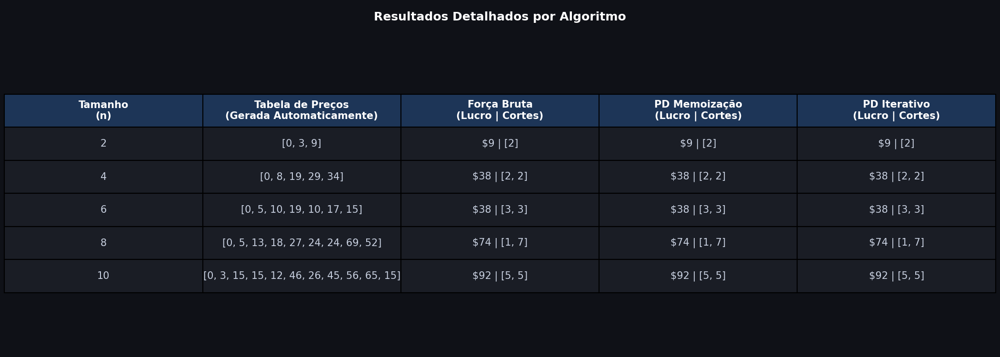
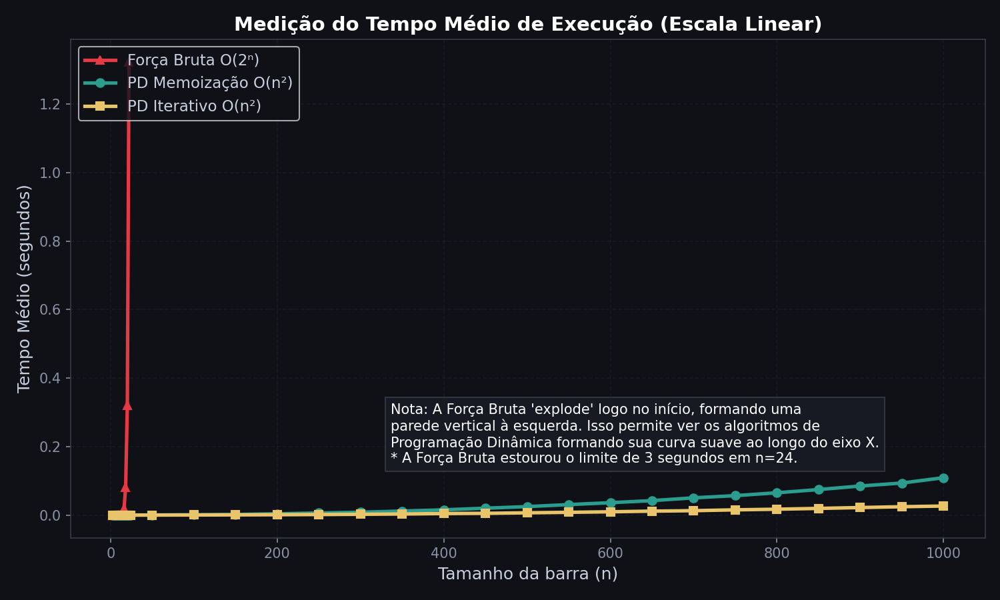
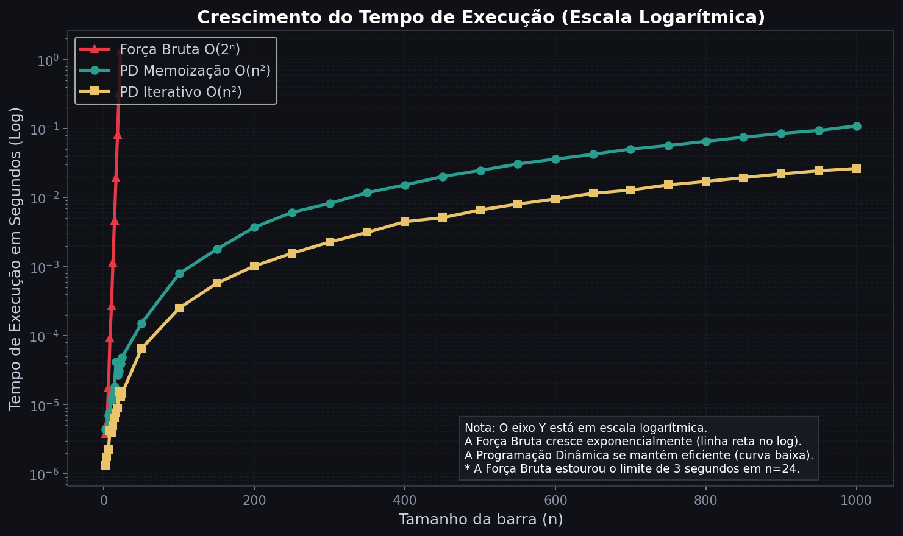

# Análise de Desempenho: Problema do Corte de Barras

Este projeto apresenta um estudo e análise de complexidade de três abordagens diferentes para resolver o Problema do Corte de Barras (Rod Cutting Problem). O objetivo principal é demonstrar, na prática, a diferença brutal de desempenho entre algoritmos de tempo exponencial e tempo polinomial.

## 📁 Estrutura de Ficheiros

O projeto está modularizado nos seguintes arquivos de código-fonte:
* **`corte_barras.py`**: Contém a implementação pura dos três algoritmos (Força Bruta, PD Memoização e PD Iterativo) e a função de geração de dados de teste.
* **`experimento.py`**: O motor de execução. Orquestra a coleta de tempos, aplica o número de repetições para a média, define os limites de *timeout* e coordena as chamadas.
* **`plots.py`**: Responsável pela renderização visual dos dados coletados, gerando os gráficos de análise e a tabela de dados.

---

## ✅ Cumprimento dos Requisitos

### 1. Implementação dos Algoritmos Comparados
Foram implementadas e comparadas três versões para a resolução do problema:
* **Força Bruta (Recursiva Pura):** Explora todas as combinações possíveis de cortes. Complexidade $O(2^n)$.
* **Programação Dinâmica (Memoização - *Top-Down*):** Abordagem recursiva que guarda os resultados de subproblemas já resolvidos para evitar recálculos. Complexidade $O(n^2)$.
* **Programação Dinâmica (Iterativa - *Bottom-Up*):** Constrói a solução iterativamente a partir dos problemas mais pequenos. Complexidade $O(n^2)$.

### 2. Geração Automática das Entradas de Teste
Para garantir a imparcialidade e a automação do teste, não existem valores codificados manualmente (*hardcoded*). Foi implementada uma função de geração automática que cria listas de preços aleatórias proporcionais ao tamanho da barra. A utilização de uma **semente (*seed*) fixa** garante que todos os algoritmos recebam exatamente a mesma entrada, assegurando uma comparação justa em diferentes execuções.

### 3. Verificação de Corretude (Mesma Resposta)
O experimento comprova que, para tabelas de preços geradas aleatoriamente, os três algoritmos produzem **exatamente o mesmo lucro máximo e a mesma combinação de cortes**, validando a corretude lógica de todas as implementações antes de se proceder à avaliação de tempo.

### 4. Medição do Tempo Médio de Execução
A coleta de tempos não depende de uma execução única, mitigando assim o ruído do Sistema Operacional. O motor de testes roda cada algoritmo múltiplas vezes (repetições) para a mesma entrada e calcula a **média aritmética** através do `time.perf_counter()`. A medição inclui também um mecanismo inteligente de *Timeout* para impedir o bloqueio permanente da máquina perante a explosão combinatória da Força Bruta. 

Abaixo, a prova visual do limite da Força Bruta na escala linear:

### 5. Gráficos Comparando o Crescimento
O comportamento assintótico dos algoritmos à medida que o $n$ cresce é evidenciado no gráfico abaixo. A utilização da escala logarítmica permite observar em simultâneo a explosão exponencial (que se torna uma reta) e a estabilidade polinomial da Programação Dinâmica.

---

## 🔬 Discussão dos Resultados

A análise dos dados extraídos durante os testes experimentais permite extrair conclusões claras e factuais sobre a complexidade computacional das abordagens:

**A Tragédia da Exponencialidade (Força Bruta)**
Como evidenciado no Gráfico de Tempo Médio (escala linear), a abordagem de Força Bruta demonstrou uma total inviabilidade de escalabilidade. A curva formou o que visualmente se assemelha a uma "parede vertical" à esquerda do gráfico. O algoritmo atinge rapidamente o limite crítico de espera estipulado para $n$ em torno dos 20-24. Este comportamento ratifica na prática a natureza agressiva da sua complexidade temporal $O(2^n)$. A necessidade de aplicar um *timeout* empírico prova que, perante a duplicação do esforço a cada incremento unitário em $n$, o poder de processamento da máquina é rapidamente esgotado.

**O Poder do Registro (Programação Dinâmica)**
Em forte contraste, as duas abordagens de Programação Dinâmica apresentaram uma eficiência extraordinária. No Gráfico Linear, ambas encontram-se achatadas junto ao eixo inferior, parecendo executar em tempo nulo perante a Força Bruta. Contudo, é o Gráfico Comparativo em Escala Logarítmica que revela a verdadeira natureza do seu crescimento. 

Neste espaço logarítmico, a explosão da Força Bruta assume o formato de uma linha reta ascendente. Entretanto, as curvas da Memoização e Iterativa descolam ligeiramente, exibindo o seu padrão polinomial suave $O(n^2)$. As abordagens conseguem resolver entradas massivas ($n=1000$) numa pequena fração de segundo. 

**Memoização vs Iterativo**
As medições indicam que, apesar de pertencerem à mesma classe de complexidade assintótica $O(n^2)$, a versão Iterativa (*Bottom-Up*) tende a ser marginalmente mais célere que a versão com Memoização (*Top-Down*). Isto decorre não da complexidade do problema, mas das restrições arquiteturais da linguagem (Python) — a versão Iterativa não sofre com o custo de empilhamento (*overhead*) inerente às múltiplas chamadas recursivas, gerindo o armazenamento diretamente em memória contígua (arrays/listas).

**Conclusão**
O projeto comprova inequivocamente que a mera corretude do código não é suficiente no desenho de software. A Programação Dinâmica, ao abdicar do recálculo através do uso estratégico de memória espacial, transforma um problema intrinsecamente insolúvel (para dimensões reais) numa tarefa de execução trivial, evidenciando o valor vital da análise algorítmica.